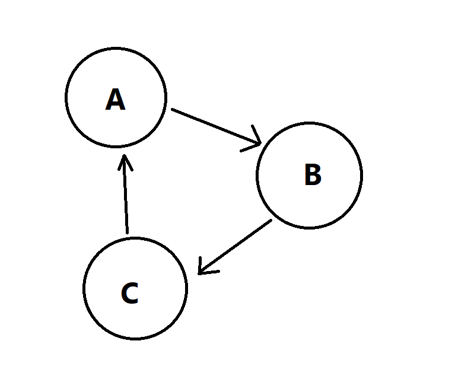
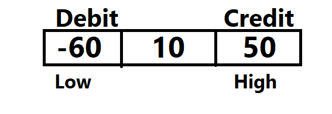

# Splitwise App Algorithm
 
An Easy Example to Example To Explain It:-  
Let us assume there are three persons:- A,B and C 
A owes B 100 Rupees 
B owes C 50 Rupees 
C owes A 40 Rupees 

Here in the end each person will be in debit mode or credit mode. 
To simplify transaction we need total Net Amount. 

Here, 
 A is losing 100 and gaining 40 :- -60 
 B is losing 50 and gaining 100 :-  50 
 C is losing 40 and gaining 50  :-  10 
 
Lets try to settle these amount:- 
Debit Mode   Credit Mode 
A -60         B 50 
	      C 10 
 
So here we choose the largest debiter and try to settle the largest crediter.
I will take 50 rupees from A and settle the credit of B. So doing this A will 
have 10 Rupees. Now we choose the largest crediter.Once we have 2 people we will
observe net amount of debit will be equal to amount of credit. So A will give 
10 Rupees to C. So doing this we solve it in 2 Transaction.

## PseudoCode 
1.Make a list of people who want to debit. 
2.Make a list of people who want to credit. 

And we pick a person who is the highest debiter and try to settle as many person by
picking the highest crediters. You can make a max heap for both of them.So if we this
approach then complexity will be nlogn and if linear search then n^2.

### An Implementation with different data structure.

## MultiSet
MultiSet is a set that contains multiple element with the same value.

 
Take two pointers:- 
Low and High. 
The left are debiters and right are crediters. 
We can pick the smallest number and try to settle the highest number for right.
So this will help to settle transaction.  
		=> min(abs|-60|,50) 
		=> 50 
low = low+50 = -10 
high = high-50 = 0 
For zero we remove it to remove completed transaction. 
Then, 
 low = -10 
 high = 10 
We can pick the smallest number and try to settle the highest number for right.
So this will help to settle transaction.  
		=> min(abs|-10|,10) 
		=> 10 
 low = low+10 = 0 
 high = high-10 = 0 
Finally we will have zero entry in the multiset and this make sure there is no 
pending transaction. 
